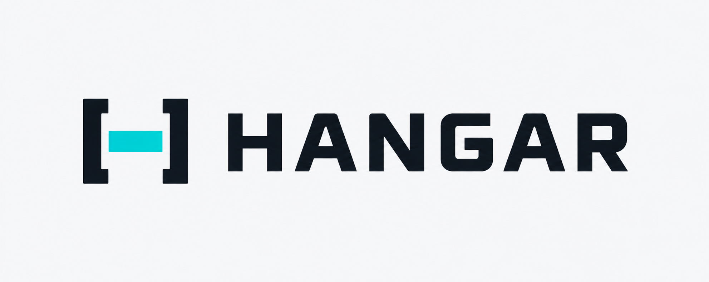

# Hangar

<p align="center">
  
</p>

A terminal-native, vendor-neutral capability picker for finding the agents, skills, and plugins already available to your AI tools.


It reads the real filesystem. There is no browser runtime, account, database, or catalog to maintain.

## Install

```sh
git clone https://github.com/PedroPini/hangar.git
cd hangar
pnpm add --global .
```

Hangar requires Node.js 20 or newer. Once installed, run it from any project:

```sh
cd /path/to/project
hangar
```

Type to search, use the arrow keys, press `Tab` to switch between skills, agents, and plugins, press `Shift+Tab` to switch between project and global capabilities, and press `F2` (the default) to open shortcut settings. The picker groups both scopes visibly, marks project overrides, and shows the selected capability in a responsive preview. Press `Enter` to select. Skills and agents print their usable reference; plugins print their manifest path, or their install directory when the host provides no manifest.

Wide terminals use a three-pane library: real catalog filters on the left, searchable capabilities in the middle, and complete selected-capability details on the right. Medium terminals collapse to list and details; narrow terminals stack them.

```sh
hangar --copy
hangar --query pdf --first
hangar --scope project
hangar list --kind plugin
```

## Configure shortcuts

Press `F2` inside the picker, use `↑/↓` to choose a shortcut, press `Enter`, then press the new key combination. Hangar validates and saves it immediately to `~/.config/hangar/config.json`; `Esc` cancels a change.

The same settings can also be inspected or changed from the command line:

```sh
hangar config
hangar config --type-key ctrl+t
hangar config --scope-key ctrl+s
hangar config --config-key f3
```

The picker shows all three shortcuts in its interface. It accepts `Tab`, `Shift+Tab`, modified keys such as `Ctrl+S` or `Alt+S`, and function keys such as `F2`. It explains and rejects duplicate shortcuts and keys already reserved for selecting, moving, clearing, or closing.

## Use it from the Codex composer

Launch Codex with the picker as its external prompt editor:

```sh
VISUAL=hangar-editor codex
```

Inside Codex, press `Ctrl+G`. The native picker opens in the same terminal. Select a capability and it is inserted into the existing Codex composer when the picker closes.

## What is real now

- Reads the portable `.agents` convention first, with adapters for Claude Code, Codex, Cursor, Gemini CLI, and GitHub Copilot locations.
- Walks relevant project capability folders up to the repository boundary and reads active Claude plugin installs for the current project.
- Lists plugins as their own capability type, including standalone registry installs that bundle no skills or agents.
- Connects manifest-backed plugins to the skills and agents they bundle.
- Includes the built-in Codex `default`, `worker`, and `explorer` agents.
- Extracts names and short descriptions from Markdown skills and Markdown/TOML agents.
- Collapses identical copies and symlinks while preserving their tool sources.
- Opens a searchable native terminal picker with no runtime dependencies.
- Keeps capability type and installation scope as separate, keyboard-controlled filters.
- Groups project and global results with textual labels that do not rely on color.
- Adapts between three-pane, two-pane, and stacked layouts without changing the selection workflow.
- Shows what the selected capability does, where it came from, and what reference will be inserted; long source paths wrap instead of being shortened.
- Prints Codex, Claude Code, name-only, or path references for host adapters.
- Supports machine-readable discovery with `hangar list --json`.

This version is intentionally read-only. It does not install, edit, move, or delete capabilities.
It also does not invent usage history, trigger clashes, categories, or token statistics that the discovered files do not provide.

## Discovery model

`SKILL.md` is the portable skill unit. Hangar treats `.agents/skills` as the cross-client source, then adds small filesystem adapters for each supported host. Agent and plugin definitions do not yet have equivalent universal specifications, so Hangar reads shared conventions plus each host's native locations and install registry where available.

- Claude Code: `.claude/skills`, `.claude/agents`, and active manifest-backed or standalone plugin installs.
- Codex: `.codex/skills`, `.codex/agents`, and manifest-backed plugin caches.
- Cursor: `.cursor/skills` and `.cursor/agents`.
- Gemini CLI: `.gemini/skills` and `.gemini/agents`.
- GitHub Copilot: `.github/skills`, `.github/agents`, and `~/.copilot/skills`.

The same capability may be reachable through several hosts or symlinks. Hangar collapses those copies into one result while retaining every source and content variant. Plugins, their bundled skills, and their bundled agents remain separate selectable results so one is never mistaken for another.

## Host integration boundary

Codex does not currently document an extension point for replacing its live `@` popup. `hangar-editor` therefore uses Codex's supported external-editor seam. Replacing `@` itself would require a Codex source change; other hosts can call the same picker core through their own extension APIs.

## Checks

```sh
pnpm check
pnpm scan -- --project /path/to/project
node cli.mjs doctor --project /path/to/project
```
